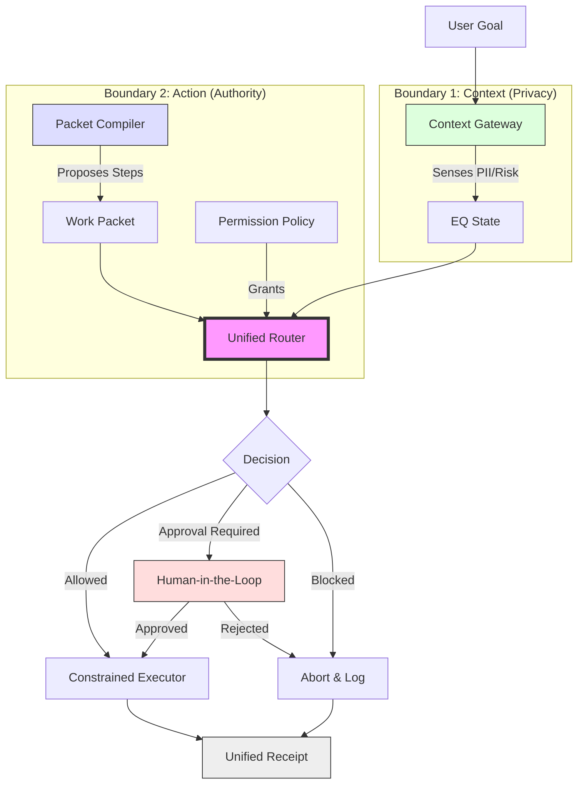

# Architecture Diagram: Agentic OS Unified Governance

## Mermaid.js Flow

## Governance Logic

1. **Context Filter**: Before any work is proposed, the system determines the "State of the User" (Risk/PII).
2. **Delegation Proposal**: A "compiler" generates a structured request for work.
3. **Unified Check**: The Router asks: *"Given this specific user context, is this specific work packet authorized?"*
4. **Execution**: Work is performed only by a constrained executor that cannot deviate from the validated packet.
5. **Audit**: A single receipt proves the decision chain for both the information that crossed the boundary and the actions that were performed.
